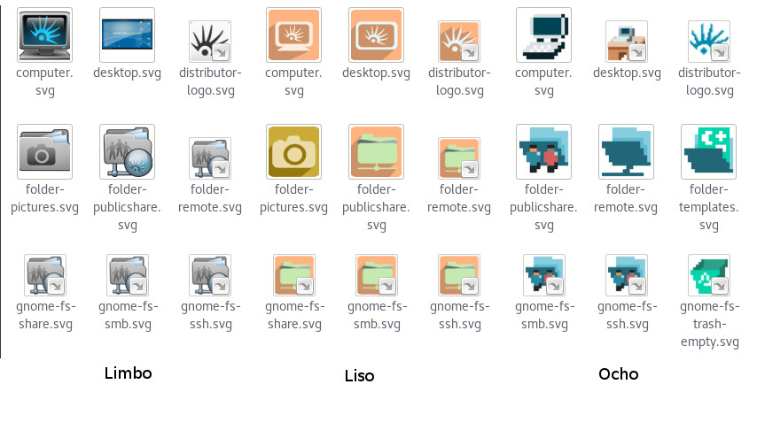

# Temas de Iconos de Huayra GNU/Linux

Este proyecto reune los sucesivos temas de íconos desarrollados para **Huayra GNU/Linux** por el equipo Huayra.

Incluye los siguientes temas:

* Huayra Violeta
* Huayra Mayo
* Huayra Limbo
* Huayra Verde Fresco
* Huayra Liso
* Huayra Ocho

## Autores

Estos iconos fueron diseñados por

* Carolina Hortal
* Claudio *Maléfico* Andaur
* Iván Hoffmann

para Huayra GNU/Linux. 

IMPORTANTE
==========
El repo lo estamos reorganizando para ir separando cada build por theme porque hacerlos todos juntos
no tenian sentido. Reconstruir todos los iconos cada vez que un solo icono de theme se modifica es muy costoso
Ya que es un proceso bastante largo e importante en cuanto a necesidad de recursos.

Por lo tanto, estamos ponidendo cada derectorio _debian_ dentro de cada theme con una copia de los _scripts_.
Esto ultimo luego los vamos a unificar y quitar esta redundancia.

Themes ya separados:

  * huayra-4
  * huayra-jm
  * huayra-liso

Themes por corregir:

  * accesible
  * cartoon
  * fresco-verde
  * limbo
  * mayo
  * ocho
  * violeta
  * violeta-2
