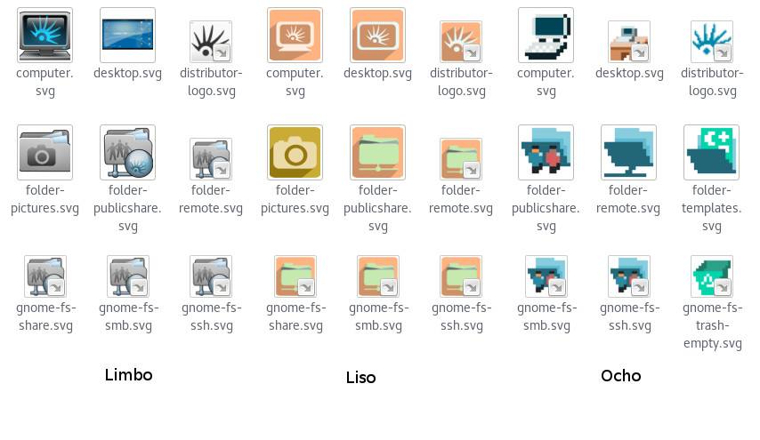

# Temas de Iconos de Huayra GNU/Linux

Este proyecto reune los sucesivos temas de íconos desarrollados para **Huayra GNU/Linux** por el equipo Huayra.

Incluye los siguientes temas:

* Huayra Violeta
* Huayra Mayo
* Huayra Limbo
* Huayra Verde Fresco
* Huayra Liso
* Huayra Ocho

## Autores

Estos iconos fueron diseñados por

* Carolina Hortal
* Claudio *Maléfico* Andaur
* Iván Hoffmann

para Huayra GNU/Linux. 
